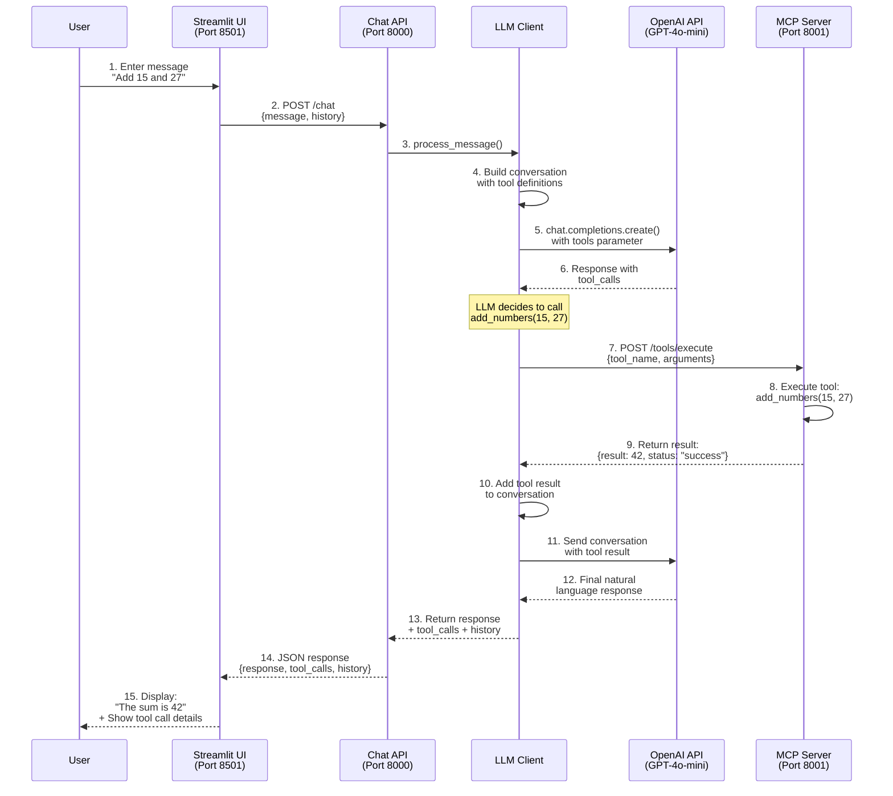
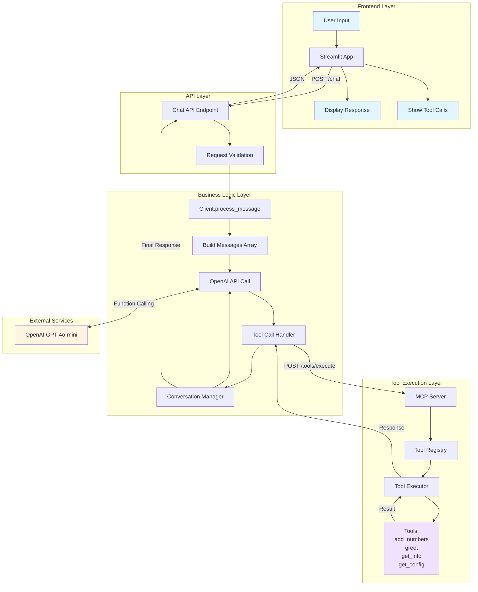

# MCP Demo - AI Chat Assistant with Tool Calling

A full-stack AI chat application demonstrating the Model Context Protocol (MCP) pattern with LLM function calling capabilities. The application uses a multi-tier architecture with Streamlit UI, FastAPI middleware, OpenAI integration, and an MCP server for tool execution.

## Table of Contents

- [Architecture](#architecture)
- [Flow Diagram](#flow-diagram)
- [Tech Stack](#tech-stack)
- [Project Structure](#project-structure)
- [Setup Instructions](#setup-instructions)
- [Running the Application](#running-the-application)
- [API Documentation](#api-documentation)
- [Available Tools](#available-tools)
- [Example Usage](#example-usage)

---

## Architecture

The application follows a **3-tier microservices architecture**:

```
┌─────────────────────────────────────────────────────────────────┐
│                         USER INTERFACE                           │
│                                                                   │
│  ┌───────────────────────────────────────────────────────────┐  │
│  │                    Streamlit App                           │  │
│  │                   (Port: 8501)                             │  │
│  │  - Chat UI                                                 │  │
│  │  - Message History                                         │  │
│  │  - Tool Call Display                                       │  │
│  └────────────────────────┬──────────────────────────────────┘  │
└────────────────────────────┼─────────────────────────────────────┘
                             │ HTTP POST /chat
                             ▼
┌─────────────────────────────────────────────────────────────────┐
│                      APPLICATION LAYER                           │
│                                                                   │
│  ┌───────────────────────────────────────────────────────────┐  │
│  │                     Chat API                               │  │
│  │                   (Port: 8000)                             │  │
│  │  - FastAPI Server                                          │  │
│  │  - Request/Response Handling                               │  │
│  └────────────────────────┬──────────────────────────────────┘  │
│                           │                                      │
│  ┌────────────────────────▼──────────────────────────────────┐  │
│  │                   LLM Client                               │  │
│  │  - OpenAI Integration (GPT-4o-mini)                        │  │
│  │  - Function Calling Logic                                  │  │
│  │  - Conversation Management                                 │  │
│  └────────────────────────┬──────────────────────────────────┘  │
└────────────────────────────┼─────────────────────────────────────┘
                             │ HTTP POST /tools/execute
                             ▼
┌─────────────────────────────────────────────────────────────────┐
│                       TOOL EXECUTION LAYER                       │
│                                                                   │
│  ┌───────────────────────────────────────────────────────────┐  │
│  │                   MCP Server                               │  │
│  │                   (Port: 8001)                             │  │
│  │  - FastMCP Framework                                       │  │
│  │  - Tool Registry                                           │  │
│  │  - Tool Execution                                          │  │
│  │                                                            │  │
│  │  Available Tools:                                          │  │
│  │  • add_numbers(a, b)                                       │  │
│  │  • greet(name)                                             │  │
│  │  • get_info()                                              │  │
│  │  • get_config()                                            │  │
│  └───────────────────────────────────────────────────────────┘  │
└─────────────────────────────────────────────────────────────────┘
```

---

## Flow Diagram

### Complete Request-Response Flow



### Detailed Component Interaction



---

## Tech Stack

### Frontend
- **Streamlit** - Interactive web UI framework
- **Requests** - HTTP client for API communication

### Backend
- **FastAPI** - Modern web framework for APIs
- **Uvicorn** - ASGI server
- **Pydantic** - Data validation

### AI/LLM
- **OpenAI API** - GPT-4o-mini model
- **Function Calling** - Tool/function execution

### MCP Layer
- **FastMCP** - Model Context Protocol framework
- **Python decorators** - Tool registration

### Other
- **python-dotenv** - Environment variable management

---

## Project Structure

```
mcp_demo/
├── streamlit_app.py              # Frontend UI application
├── main.py                        # Chat API server (port 8000)
├── client.py                      # LLM client with OpenAI integration
├── mcp_components/
│   ├── __init__.py
│   ├── mcp_server.py             # MCP server with tools (port 8001)
│   └── tools.py                  # (Legacy - tools now in mcp_server.py)
├── requirements.txt              # Python dependencies
├── .env                          # Environment variables (create this)
├── README.md                     # This file
└── README_SETUP.md              # Quick setup guide
```

---

## Setup Instructions

### 1. Clone or Download the Project

```bash
cd /Users/ankit/Desktop/varsha_projects/mcp_demo
```

### 2. Create Virtual Environment (Recommended)

```bash
python -m venv venv
source venv/bin/activate  # On Windows: venv\Scripts\activate
```

### 3. Install Dependencies

```bash
pip install -r requirements.txt
```

### 4. Configure Environment Variables

Create a `.env` file in the project root:

```bash
# .env
OPENAI_API_KEY=your_openai_api_key_here
```

Get your OpenAI API key from: https://platform.openai.com/api-keys

---

## Running the Application

You need to run **3 separate terminal windows** (keep all running simultaneously):

### Terminal 1: Start MCP Server

```bash
cd /Users/ankit/Desktop/varsha_projects/mcp_demo
python mcp_components/mcp_server.py
```

Expected output:
```
INFO:     Started server process [xxxxx]
INFO:     Waiting for application startup.
INFO:     Application startup complete.
INFO:     Uvicorn running on http://0.0.0.0:8001 (Press CTRL+C to quit)
```

### Terminal 2: Start Chat API

```bash
cd /Users/ankit/Desktop/varsha_projects/mcp_demo
python main.py
```

Expected output:
```
INFO:     Started server process [xxxxx]
INFO:     Waiting for application startup.
INFO:     Application startup complete.
INFO:     Uvicorn running on http://0.0.0.0:8000 (Press CTRL+C to quit)
```

### Terminal 3: Start Streamlit UI

```bash
cd /Users/ankit/Desktop/varsha_projects/mcp_demo
streamlit run streamlit_app.py
```

Expected output:
```
  You can now view your Streamlit app in your browser.

  Local URL: http://localhost:8501
  Network URL: http://192.168.x.x:8501
```

### Access the Application

Open your browser and navigate to: **http://localhost:8501**

---

## API Documentation

### Chat API (Port 8000)

#### Health Check
```http
GET http://localhost:8000/
```

Response:
```json
{
  "message": "Chat API is running",
  "status": "ok"
}
```

#### Chat Endpoint
```http
POST http://localhost:8000/chat
Content-Type: application/json

{
  "message": "Add 15 and 27",
  "conversation_history": []
}
```

Response:
```json
{
  "response": "The sum of 15 and 27 is 42.",
  "conversation_history": [...],
  "tool_calls": [
    {
      "tool": "add_numbers",
      "arguments": {"a": 15, "b": 27}
    }
  ]
}
```

### MCP Server (Port 8001)

#### Health Check
```http
GET http://localhost:8001/
```

Response:
```json
{
  "message": "MCP Server is running",
  "status": "ok"
}
```

#### List Tools
```http
GET http://localhost:8001/tools/list
```

Response:
```json
{
  "tools": [
    {
      "name": "add_numbers",
      "description": "Add two numbers together",
      "parameters": {
        "type": "object",
        "properties": {
          "a": {"type": "integer", "description": "The a parameter"},
          "b": {"type": "integer", "description": "The b parameter"}
        },
        "required": ["a", "b"]
      }
    },
    ...
  ]
}
```

#### Execute Tool
```http
POST http://localhost:8001/tools/execute
Content-Type: application/json

{
  "tool_name": "add_numbers",
  "arguments": {
    "a": 15,
    "b": 27
  }
}
```

Response:
```json
{
  "result": 42,
  "status": "success"
}
```

---

## Available Tools

### 1. add_numbers
**Description:** Add two numbers together

**Parameters:**
- `a` (integer): First number
- `b` (integer): Second number

**Example:** "What is 15 plus 27?"

---

### 2. greet
**Description:** Greet someone by name

**Parameters:**
- `name` (string): Name of the person to greet

**Example:** "Greet Alice"

---

### 3. get_info
**Description:** Get server information

**Parameters:** None

**Example:** "What's the server info?" or "Show me server details"

---

### 4. get_config
**Description:** Get server configuration

**Parameters:** None

**Example:** "Show me the config" or "What's the configuration?"

---

## Example Usage

### Example 1: Math Operation
```
User: "What is 123 plus 456?"

Flow:
1. OpenAI LLM analyzes the question
2. LLM decides to call add_numbers(123, 456)
3. MCP server executes the tool
4. Returns result: 579
5. LLM generates natural response: "The sum of 123 and 456 is 579."

Tool Call Displayed:
{
  "tool": "add_numbers",
  "arguments": {"a": 123, "b": 456}
}
```

### Example 2: Greeting
```
User: "Greet John"

Flow:
1. LLM calls greet("John")
2. MCP server returns: "Hello, John! Welcome to the MCP server."
3. LLM response: "I've greeted John!"

Tool Call Displayed:
{
  "tool": "greet",
  "arguments": {"name": "John"}
}
```

### Example 3: Server Information
```
User: "What's the server info?"

Flow:
1. LLM calls get_info()
2. MCP server returns server details
3. LLM formats the response for the user

Tool Call Displayed:
{
  "tool": "get_info",
  "arguments": {}
}
```

### Example 4: Conversation without Tools
```
User: "Hello, how are you?"

Flow:
1. LLM determines no tool is needed
2. Responds directly without tool execution
3. No tool calls displayed
```

---

## How It Works

### 1. User Input Processing
- User types a message in Streamlit UI
- Message is sent to Chat API with conversation history

### 2. LLM Decision Making
- Client sends message to OpenAI with tool definitions
- GPT-4o-mini analyzes the request
- LLM decides whether to call a tool based on the message content

### 3. Tool Execution (if needed)
- Client extracts tool name and arguments from LLM response
- HTTP POST request sent to MCP Server
- MCP Server executes the requested tool
- Result returned to Client

### 4. Response Generation
- Tool result added to conversation context
- Client sends updated conversation back to OpenAI
- LLM generates natural language response incorporating the tool result

### 5. Display to User
- Final response displayed in Streamlit
- Tool calls shown in expandable section
- Conversation history maintained for context

---

## Troubleshooting

### Port Already in Use
```bash
# Find process using port 8000
lsof -i :8000
# Kill the process
kill -9 <PID>

# Or use different ports by modifying:
# - main.py: uvicorn.run(app, host="0.0.0.0", port=8000)
# - mcp_components/mcp_server.py: uvicorn.run(app, host="0.0.0.0", port=8001)
# - streamlit_app.py: API_URL = "http://localhost:8000"
# - client.py: MCP_SERVER_URL = "http://localhost:8001"
```

### OpenAI API Error
```
Error: Invalid API key
Solution: Check your .env file and ensure OPENAI_API_KEY is set correctly
```

### MCP Server Connection Error
```
Error: Cannot connect to MCP server
Solution: Ensure MCP server is running on port 8001
```

### Tools Not Registering
```
Problem: /tools/list returns empty array
Solution: Restart the MCP server (Terminal 1)
```

---

## Adding New Tools

To add a new tool, edit `mcp_components/mcp_server.py`:

```python
@mcp.tool()
def your_new_tool(param1: str, param2: int) -> str:
    """Description of what the tool does"""
    # Your implementation here
    result = f"Processed {param1} with {param2}"
    return result
```

Then update `client.py` to include the new tool definition:

```python
tools = [
    # ... existing tools ...
    {
        "type": "function",
        "function": {
            "name": "your_new_tool",
            "description": "Description of what the tool does",
            "parameters": {
                "type": "object",
                "properties": {
                    "param1": {
                        "type": "string",
                        "description": "Description of param1"
                    },
                    "param2": {
                        "type": "integer",
                        "description": "Description of param2"
                    }
                },
                "required": ["param1", "param2"]
            }
        }
    }
]
```

Restart both MCP server and Chat API.

---

## Architecture Benefits

### 1. Separation of Concerns
- **UI Layer**: Handles user interaction only
- **API Layer**: Manages business logic and orchestration
- **Tool Layer**: Executes specific tools in isolation

### 2. Scalability
- Each component can be scaled independently
- MCP server can handle multiple tool requests concurrently
- Stateless design allows for horizontal scaling

### 3. Maintainability
- Tools are isolated and easy to add/modify
- Clear API contracts between layers
- Easy to test individual components

### 4. Flexibility
- Swap Streamlit for any other frontend (React, Vue, etc.)
- Change LLM provider without affecting tool execution
- Add new tools without modifying core logic

### 5. Security
- Environment variables for sensitive data
- API layer provides validation and error handling
- Tool execution isolated from user input

---

## Technology Choices

### Why FastMCP?
- Built specifically for Model Context Protocol
- Easy tool registration with decorators
- Seamless integration with FastAPI

### Why OpenAI Function Calling?
- Native support for tool/function execution
- Intelligent decision-making on when to call tools
- Handles parameter extraction automatically

### Why 3-Tier Architecture?
- Clear separation between UI, logic, and execution
- Each service can be developed/deployed independently
- Easier to debug and maintain

### Why Streamlit?
- Rapid UI development
- Built-in state management
- Perfect for AI/ML applications

---

## Future Enhancements

- [ ] Add authentication and user management
- [ ] Implement rate limiting
- [ ] Add database for conversation persistence
- [ ] Create admin panel for tool management
- [ ] Add logging and monitoring
- [ ] Implement caching for repeated queries
- [ ] Add support for file uploads
- [ ] Integrate with more LLM providers (Claude, Gemini)
- [ ] Add streaming responses
- [ ] Implement tool result caching

---

## License

This project is for educational and demonstration purposes.

---

## Contributing

To contribute:
1. Fork the repository
2. Create a feature branch
3. Make your changes
4. Test thoroughly
5. Submit a pull request

---

## Contact

For questions or issues, please create an issue in the repository.

---

## Acknowledgments

- **Anthropic** - For the Model Context Protocol concept
- **OpenAI** - For GPT-4o-mini and Function Calling API
- **FastAPI & Streamlit** - For excellent frameworks

---

**Last Updated:** December 11, 2024
**Version:** 1.0.0